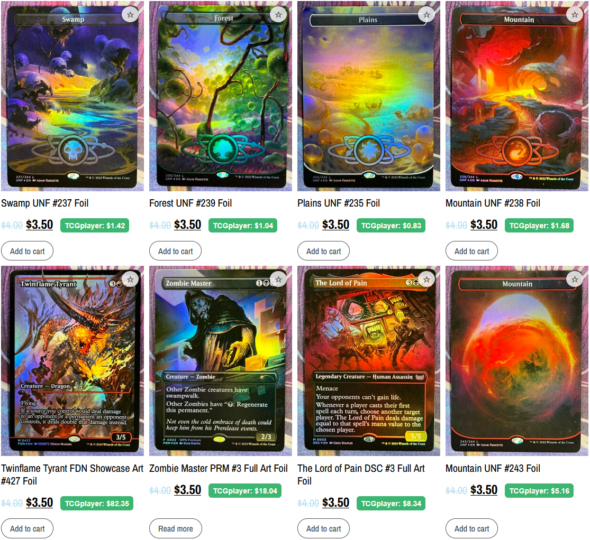
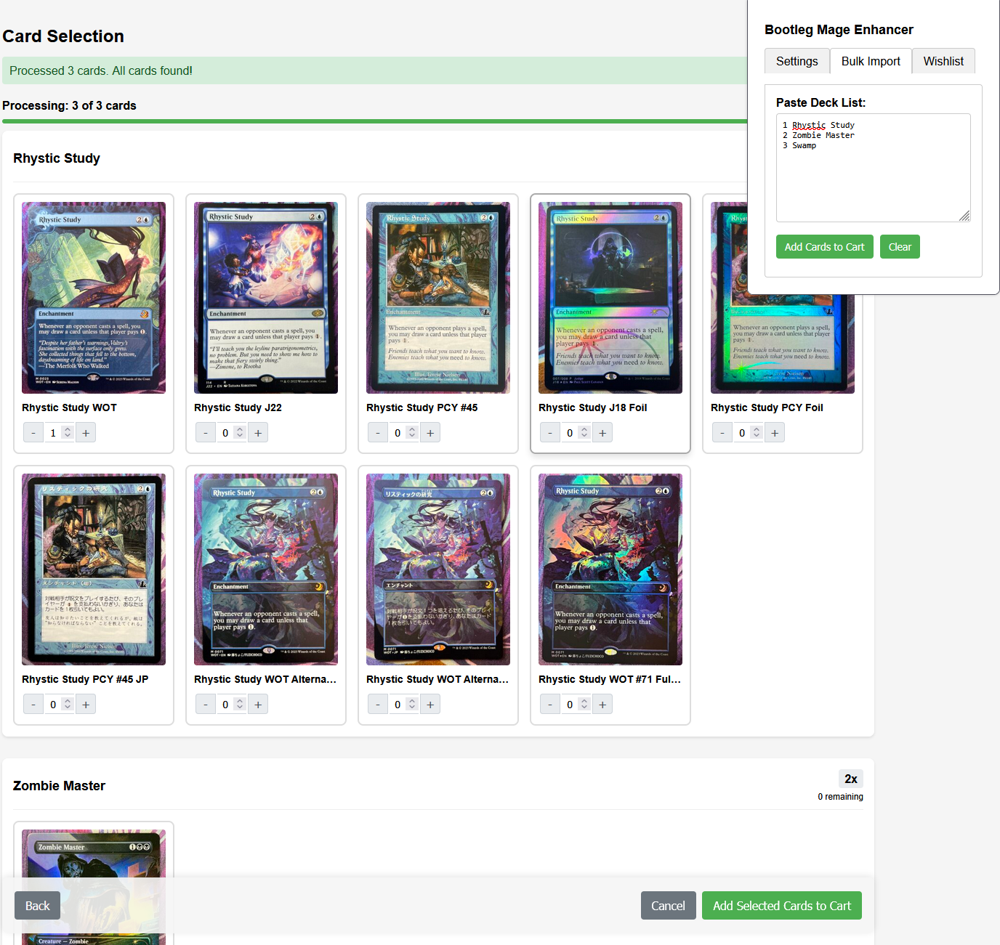
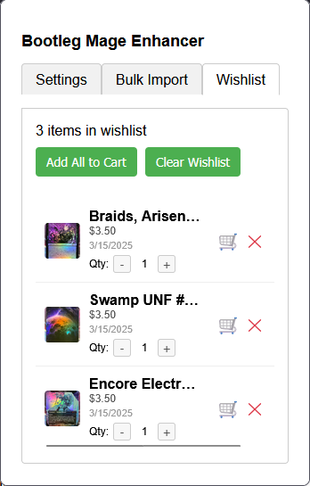

# Bootleg Mage Enhancer

A browser extension for Firefox, Chrome, and Edge that enhances the [Bootleg Mage](https://bootlegmage.com) shopping experience with price comparisons, bulk deck imports, and wishlist management.

## Screenshots

*TCGplayer price comparison in action*

*Importing a deck list with the bulk import tool*

*Managing your wishlist of cards*

## Features

### TCGplayer Price Comparison
- Automatically displays TCGplayer prices alongside Bootleg Mage prices
- Helps you make informed purchasing decisions with real-time market data
- Prices are fetched from Scryfall API and cached to reduce API requests

### Bulk Deck Import
- Paste Magic: The Gathering deck lists directly into the extension
- Automatically matches cards with available products on Bootleg Mage
- Select specific versions when multiple options are available
- Add entire decks to your cart with a single click

### Wishlist Management
- Add cards to your wishlist while browsing
- View and manage your wishlist through the extension popup
- Add all wishlist items to your cart with one click
- Adjust quantities for each wishlist item

## Installation

You can install the extension manually in your browser. Pre-packaged versions are available in the [Releases](https://github.com/koiseka/bootleg-mage-enhancer/releases) section.

### Firefox
1. Download the `.zip` file from the [Releases](https://github.com/koiseka/bootleg-mage-enhancer/releases) page
2. Open Firefox and navigate to `about:addons`
3. Click the gear icon and select "Install Add-on From File..."
4. Select the downloaded `.zip` file
5. Click "Add" when prompted

### Chrome
1. Download and extract the zip file from the [Releases](https://github.com/koiseka/bootleg-mage-enhancer/releases) page
2. Open Chrome and navigate to `chrome://extensions/`
3. Enable "Developer mode" using the toggle in the top-right corner
4. Click "Load unpacked" and select the extracted folder
5. The extension will appear in your browser toolbar

### Edge
1. Download and extract the zip file from the [Releases](https://github.com/koiseka/bootleg-mage-enhancer/releases) page
2. Open Edge and navigate to `edge://extensions/`
3. Enable "Developer mode" using the toggle in the left sidebar
4. Click "Load unpacked" and select the extracted folder
5. The extension will appear in your browser toolbar

## Usage

### Price Comparison
- Simply browse Bootleg Mage as normal
- TCGplayer prices will automatically appear next to Bootleg Mage prices
- Prices are displayed as badges with "TCGplayer: $XX.XX"
- Click on a price badge to view the card on TCGplayer

### Bulk Deck Import
1. Click the extension icon in your toolbar
2. Navigate to the "Bulk Import" tab
3. Paste your deck list in the format: `1 Card Name` (one card per line)
4. Click "Add Cards to Cart"
5. Select specific versions for each card when prompted
6. Review your selections and click "Add Selected Cards to Cart"

### Wishlist
1. While browsing Bootleg Mage, click the star icon on any card to add it to your wishlist
2. Access your wishlist by clicking the extension icon and navigating to the "Wishlist" tab
3. Manage quantities, remove items, or add all items to your cart

## Data Privacy

- The extension only connects to Bootleg Mage, Scryfall API, and a public GitHub repository
- Card data is cached locally in your browser to reduce API requests
- No personal data is collected or transmitted

## Troubleshooting

If prices aren't displaying:
1. Click the extension icon and go to the "Settings" tab
2. Click "Refresh Card Data" to fetch the latest information
3. Reload the Bootleg Mage page

## Bug Reports & Feature Requests

If you encounter any issues or would like to request missing cards:

### Reporting Bugs
1. Visit the [Issues page](https://github.com/koiseka/bootleg-mage-enhancer/issues) on GitHub
2. Click "New Issue" and select "Bug Report"
3. Include the following information:
   - Your browser and version
   - Steps to reproduce the issue
   - What you expected to happen
   - What actually happened
   - Screenshots (if applicable)

### Requesting Missing Cards
1. Visit the [Issues page](https://github.com/koiseka/bootleg-mage-enhancer/issues) on GitHub
2. Click "New Issue" and select "Card Request"
3. Include:
   - Card name
   - Set/edition
   - Card number (if known)
   - Link to the card on Bootleg Mage (if available)

## Credits

Developed for the Bootleg Mage community to enhance the shopping experience.

## License

This extension is not affiliated with or endorsed by Bootleg Mage, TCGplayer, or Scryfall.